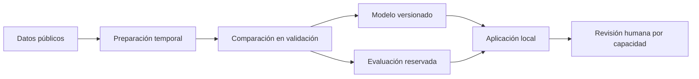

# ReservaIQ

**Priorización de reservas hoteleras con aprendizaje automático y Azure Machine Learning.**

Microproyecto 3 · Computación en la Nube · Prof. Oscar Mondragón.

**Equipo:** Juan Ospina Tenorio, Natalia Hernández Piedrahita y Miguel Ángel Diuza.

Hotel Brisa del Valle, cliente ficticio de Cali, necesita distribuir una capacidad limitada de revisión entre reservas. ReservaIQ compara modelos, estima un índice asociado a cancelación y permite seleccionar las K reservas que revisará el personal.

## Resultado medido

En 7.990 reservas históricas reservadas para prueba, seleccionar el 20 % de mayor índice reúne **705 cancelaciones entre 1.598 reservas**: precisión 44,1 %, detección 38,5 % y concentración **1,93 veces** la esperada con selección aleatoria. El resultado es retrospectivo y no demuestra cancelaciones evitadas ni dinero recuperado.

| Regla evaluada | Precisión | Detección | Uso |
| --- | ---: | ---: | --- |
| Capacidad del 20 % | 44,1 % | 38,5 % | Priorizar un número limitado de revisiones |
| Umbral 0,17 elegido en validación | 35,1 % | 80,1 % | Analizar el intercambio entre detección y falsas alertas |

Los datos provienen de dos hoteles de Portugal en 2015–2017. El cliente colombiano es ficticio. La aplicación no envía mensajes, modifica reservas ni efectúa cobros.

## Ejecutar la aplicación

Requisitos: Python 3.12. Desde la carpeta del repositorio, en macOS o Linux:

```bash
python3.12 -m venv .venv
source .venv/bin/activate
python -m pip install -r requirements.txt
python app.py --port 8765
```

En Windows PowerShell:

```powershell
py -3.12 -m venv .venv
.\.venv\Scripts\Activate.ps1
python -m pip install -r requirements.txt
python app.py --port 8765
```

Abre **http://127.0.0.1:8765**. La instalación necesita Internet una vez; después la aplicación usa el modelo incluido. Para detener el servidor, pulsa Ctrl+C. Si el puerto está ocupado, identifica primero el proceso o utiliza `--port 8766`. No abras `web/index.html` directamente: la interfaz necesita la API.

Carga únicamente el modelo incluido o artefactos propios de confianza. `joblib` no debe utilizarse para cargar modelos recibidos de fuentes desconocidas. El servidor está limitado a localhost y no es un servicio público de producción.

## Analizar un CSV

1. Abre **Explorar una reserva → Analizar un lote de reservas**.
2. Selecciona [`ejemplos-csv/reservas-listas.csv`](ejemplos-csv/reservas-listas.csv).
3. Pulsa **Analizar lote**. Se procesan ocho reservas y se descarga el resultado en JSON.

El archivo ya contiene las diez columnas exactas, separadas por comas. El [diccionario del CSV](ejemplos-csv/LEEME.md) detalla los valores admitidos. Máximo 500 registros y 150 KB; anticipación de 0–60 días y estancia de 1–30 noches.

## Qué incluye la aplicación

- **Centro de decisiones:** capacidad K, lista ordenada, resultados históricos y exportación.
- **Explorar una reserva:** inferencia real, escenarios editables, ejemplos de acierto y error, carga por lote.
- **Evidencia del modelo:** particiones, comparación de candidatos, matriz de confusión e importancia global.
- **Diseño y Azure:** componentes, procedencia verificable del modelo y costos documentados.

## Informe técnico

[Leer el informe técnico en PDF](docs/ReservaIQ-Informe-tecnico.pdf). Incluye requerimientos, alternativas, diseño, implementación, resultados, costos y fuentes.

## Diseño y reproducibilidad

[Cómo y por qué se construyó](docs/DESARROLLO.md) · [Arquitectura y componentes](docs/ARQUITECTURA.md) · [Datos y límites del modelo](docs/MODELO.md) · [Azure ML](azure/README.md) · [Evidencias](docs/EVIDENCIAS.md) · [Costos](docs/COSTOS.md).



Para reproducir el experimento completo y comprobar el proyecto:

```bash
python pipeline.py all
python -m unittest discover -s tests -v
```

El reentrenamiento reemplaza los artefactos de `artifacts/`; conserva una copia de los resultados que quieras comparar. Las versiones se fijan en `requirements.txt`. El flujo equivalente se define en `azure/pipeline.yml`. Las pruebas de GitHub Actions verifican integridad, particiones, métricas, inferencia y contrato del CSV.

## Estructura

| Ruta | Contenido |
| --- | --- |
| `core.py` | Variables, categorías, límites e inferencia |
| `pipeline.py` | Preparación, comparación y evaluación |
| `app.py`, `web/` | Servidor e interfaz |
| `data/` | Datos originales y procedencia |
| `artifacts/` | Modelo, particiones, métricas y predicciones |
| `ejemplos-csv/` | Archivo listo para cargar y diccionario |
| `azure/` | Componentes y configuración de ejecución |
| `tests/` | Pruebas reproducibles |
| `docs/` | Desarrollo, arquitectura, resultados y evidencias |

## Fuentes y licencia de datos

Antonio, N., de Almeida, A. y Nunes, L. (2019). *Hotel booking demand datasets*. Data in Brief, 22, 41–49. [Artículo y datos originales](https://doi.org/10.1016/j.dib.2018.11.126).

[Distribución TidyTuesday del 11 de febrero de 2020](https://github.com/rfordatascience/tidytuesday/tree/main/data/2020/2020-02-11). Los datos originales se distribuyen bajo **CC BY 4.0**. La selección de columnas, particiones, transformación del mes y resultados de modelado son modificaciones de este proyecto. Consulta [NOTICE](NOTICE).
