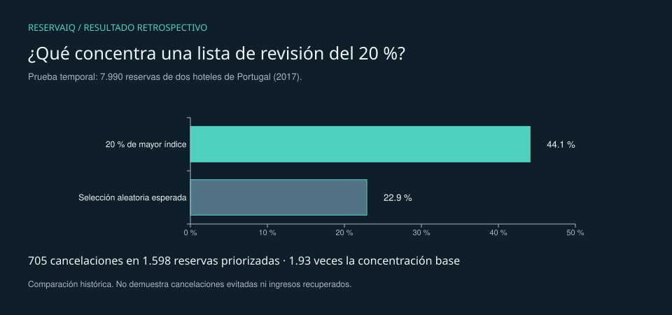

# ReservaIQ

[](https://github.com/nathernandez1189/reservaiq-azure-ml/actions/workflows/verificacion.yml)

**Priorización de reservas hoteleras con aprendizaje automático y Azure Machine Learning.**

Microproyecto 3 · Computación en la Nube · Prof. Oscar Mondragón.

**Equipo:** Juan Ospina Tenorio, Natalia Hernández Piedrahita y Miguel Ángel Diuza.

Hotel Brisa del Valle, cliente ficticio de Cali, necesita distribuir una capacidad limitada de revisión entre reservas. ReservaIQ compara modelos, estima un índice asociado a cancelación y permite seleccionar las K reservas que revisará el personal.

## Material de la entrega

[Informe técnico en PDF](docs/ReservaIQ-Informe-tecnico.pdf) · [Presentación ampliada en Canva](https://www.canva.com/d/20i32hmvo0gpTiA) · [Contenido de las 12 diapositivas](docs/PRESENTACION.md) · [Correspondencia con la rúbrica](docs/ENTREGA.md).

La presentación cubre requerimientos, alternativas, datos, diseño, evaluación, ejecución Azure, costos y demo, con una duración objetivo de 15 minutos. El enlace de Canva solicita iniciar sesión; la copia del contenido puede consultarse directamente en este repositorio. [Qué contiene cada material y cómo se relacionan el repositorio y el ZIP](docs/ENTREGA.md#repositorio-zip-y-formato-de-entrega).

## Resultado medido

En 7.990 reservas históricas reservadas para prueba, seleccionar el 20 % de mayor índice reúne **705 cancelaciones entre 1.598 reservas**: precisión 44,1 %, detección 38,5 % y concentración **1,93 veces** la esperada con selección aleatoria. El resultado es retrospectivo y no demuestra cancelaciones evitadas ni dinero recuperado.

| Regla evaluada | Precisión | Detección | Uso |
| --- | ---: | ---: | --- |
| Capacidad del 20 % | 44,1 % | 38,5 % | Priorizar un número limitado de revisiones |
| Umbral 0,17 elegido en validación | 35,1 % | 80,1 % | Analizar el intercambio entre detección y falsas alertas |

Los datos provienen de dos hoteles de Portugal en 2015–2017. El cliente colombiano es ficticio. La aplicación permite guardar y editar copias locales; no envía mensajes, modifica reservas en un hotel ni efectúa cobros.



La gráfica se genera desde las métricas guardadas con `scripts/generar_grafica.py` (dependencia opcional: ReportLab 4.4.9).

## Ejecución en Azure verificada

El pipeline **`mango_wire_5f09pdg4m3`** completó preparación, entrenamiento y evaluación en **North Central US**. El modelo `reservaiq`, versión **1**, se registró, descargó y se incorporó a esta aplicación. Sus 7.990 predicciones coinciden exactamente con las del experimento local. La huella del archivo registrado coincide con la del entrenamiento.

[Estados y procedencia](azure/evidence/run.json) · [Comparación de predicciones](azure/evidence/comparison.json) · [Registro de etapas](azure/evidence/console.txt) · [Entorno resuelto](azure/environment-lock.json) · [Cierre de recursos](azure/evidence/closure.json).

El grupo temporal de Azure fue eliminado tras verificar y descargar las salidas. El registro `reservaiq:1` se conserva como evidencia histórica y el archivo está incluido en el repositorio.

La demo se ejecuta localmente con el modelo incluido. No requiere una suscripción de Azure para evaluarla. Reentrenar en la nube crea recursos facturables; el escenario estimado es **US$1** y se documenta en [Costos](docs/COSTOS.md).

## Ejecutar la aplicación

Requisito: **Python 3.12**. Si ya clonaste el repositorio, detén el servidor y actualiza con `git pull --ff-only`.

En Windows abre `iniciar-windows.cmd` o ejecuta:

```powershell
py -3.12 iniciar.py
```

En macOS/Linux:

```bash
python3.12 iniciar.py
```

El lanzador crea `.venv` e instala las dependencias que falten antes de abrir la aplicación con ese mismo entorno. Esto evita instalar `joblib` en un Python y ejecutar la demo con otro. En macOS también puedes abrir `iniciar-mac.command`.

Abre **http://127.0.0.1:8765**. La instalación necesita Internet una vez; después la aplicación usa el modelo incluido. Para detener el servidor, pulsa Ctrl+C. Si el puerto está ocupado, identifica primero el proceso o utiliza `--port 8766`. No abras `web/index.html` directamente: la interfaz necesita la API.

Si una copia anterior en Windows muestra `Failed to fetch` y la terminal registra `UnicodeDecodeError: 'charmap'`, detén el servidor con Ctrl+C, ejecuta `git pull --ff-only` y vuelve a iniciarlo. Esta versión lee los resultados explícitamente como UTF-8. Mientras actualizas, también puedes iniciar con `.\.venv\Scripts\python.exe -X utf8 app.py --port 8765`. Después recarga el navegador con Ctrl+F5. Si Git informa cambios locales en conflicto, consérvalos y revisa el mensaje antes de actualizar.

Carga únicamente el modelo incluido o artefactos propios de confianza. `joblib` no debe utilizarse para cargar modelos recibidos de fuentes desconocidas. El servidor está limitado a localhost y no es un servicio público de producción.

## Primer uso: analizar, guardar y recuperar

1. **Fechas:** entra en Nueva reserva, elige llegada y salida en el calendario. Las noches y la anticipación se calculan automáticamente. Puedes mostrar u ocultar el calendario sin perder las fechas.
2. **Detalles:** revisa las seis opciones explicadas y añade una referencia si quieres.
3. **Revisar y guardar:** comprueba el resumen, pulsa Analizar y guardar y espera la confirmación con código `RI-…`.
4. Abre **Mis reservas** para recuperar, editar, marcar revisada, archivar o restaurar. **Cómo probarlo** incluye un recorrido de calendario y otro con resultados históricos conocidos.

El calendario no consulta disponibilidad del hotel. Admite 0–60 días de anticipación y 1–30 noches; el día de salida no añade una noche. Los ejemplos históricos, los CSV y las reservas antiguas conservan sus variables cuando no se conocen fechas completas.

**Solo analizar** no guarda. Los registros confirmados permanecen después de cerrar la aplicación, en `.runtime/reservaiq.sqlite3`. Cada computador tiene su propia base: no se comparte por GitHub ni se sincroniza con Azure. No elimines `.runtime` si quieres conservar tus reservas.

[Guía completa de uso y solución de errores](docs/GUIA-DE-USO.md) · [Pruebas guiadas](docs/PRUEBAS-GUIADAS.md) · [Decisiones de experiencia de usuario](docs/EXPERIENCIA-DE-USUARIO.md).

## Analizar y guardar un CSV

1. Abre **Nueva reserva → Importar un archivo CSV**.
2. Selecciona [`ejemplos-csv/reservas-listas.csv`](ejemplos-csv/reservas-listas.csv).
3. Pulsa **Analizar lote**: se procesan ocho reservas y aparece una vista previa.
4. Pulsa **Guardar lote** para conservarlas o **Descargar resultados** para obtener el JSON.

El [diccionario del CSV](ejemplos-csv/LEEME.md) detalla las diez columnas y sus valores. Se admiten comas o punto y coma. Máximo 500 registros y 150 KB; anticipación de 0–60 días y estancia de 1–30 noches. Un lote con errores no se guarda parcialmente. Reimportar y analizar el mismo archivo inicia un lote nuevo.

## Qué incluye la aplicación

- **Inicio:** recorrido de uso, métricas históricas y ejemplo de lista por capacidad K.
- **Nueva reserva:** calendario de llegada/salida, tres pasos, resumen de estancia, campos explicados, guardado y CSV con vista previa.
- **Mis reservas:** búsqueda, filtros, prioridades, estados de revisión y copia descargable.
- **Cómo probarlo:** pasos, resultados esperados, comprobación de conexión y soluciones a errores comunes.
- **Resultados del modelo:** particiones, candidatos, matriz de confusión e importancia global.
- **Diseño y Azure:** correspondencia con los cuatro criterios de la rúbrica, alternativas, arquitectura y flujo explicado, procedencia verificable y costos documentados.

Las reservas nuevas no cambian el entrenamiento ni las métricas históricas. El almacenamiento local no requiere recursos de Azure.

## Informe técnico

[Leer el informe técnico en PDF](docs/ReservaIQ-Informe-tecnico.pdf). Incluye requerimientos, alternativas, diseño, implementación, resultados, costos, fuentes y un anexo con las cuatro capturas comentadas.

[Ver las capturas de las cuatro vistas](docs/CAPTURAS.md). Las imágenes originales corresponden a la interfaz anterior, con cuatro vistas y sin guardado local. Muestran una sesión con indicador de modelo local; la ejecución de Azure se acredita mediante los registros enlazados arriba.

## Diseño y reproducibilidad

[Cómo y por qué se construyó](docs/DESARROLLO.md) · [Arquitectura y componentes](docs/ARQUITECTURA.md) · [Datos y límites del modelo](docs/MODELO.md) · [Azure ML](azure/README.md) · [Evidencias](docs/EVIDENCIAS.md) · [Costos](docs/COSTOS.md).


La evaluación recibe datos de prueba y el modelo entrenado; genera métricas y predicciones. El registro del modelo pertenece a Azure y se realiza después del trabajo. La descarga y verificación conectan ese resultado con la aplicación local. [Detalle de cada transferencia y componente](docs/ARQUITECTURA.md).

Para reproducir el experimento completo y comprobar el proyecto:

```bash
python -m unittest discover -s tests -v
# Opcional: reproducir el entrenamiento completo
python pipeline.py all
```

Para las pruebas de desarrollo de la interfaz, ejecuta `npm ci` y `npm test` con Node.js 20 o posterior. Node no es necesario para usar la demo.

El reentrenamiento reemplaza los artefactos de `artifacts/`; conserva una copia de los resultados que quieras comparar. Las versiones se fijan en `requirements.txt`. El flujo equivalente se define en `azure/pipeline.yml`. Las pruebas de GitHub Actions verifican integridad, particiones, métricas, inferencia y contrato del CSV.

Para regenerar la gráfica y el informe técnico a partir de los resultados guardados:

```bash
python -m pip install -r requirements-docs.txt
python scripts/generar_grafica.py
python scripts/diagrama_arquitectura.py
python scripts/generar_informe.py
```

El informe se guarda en `docs/ReservaIQ-Informe-tecnico.pdf` y `docs/Informe-tecnico.md`. En sistemas sin Arial, el generador usa Helvetica. El PDF de esta entrega fue revisado visualmente en sus doce páginas.

## Estructura

| Ruta | Contenido |
| --- | --- |
| `core.py` | Variables, categorías, límites e inferencia |
| `pipeline.py` | Preparación, comparación y evaluación |
| `app.py`, `web/` | Servidor e interfaz |
| `data/` | Datos originales y procedencia |
| `artifacts/` | Modelo, particiones, métricas y predicciones |
| `ejemplos-csv/` | Archivo listo para cargar y diccionario |
| `azure/` | Componentes y configuración de ejecución |
| `tests/` | Pruebas reproducibles |
| `docs/` | Desarrollo, arquitectura, resultados y evidencias |

## Fuentes y licencia de datos

Antonio, N., de Almeida, A. y Nunes, L. (2019). *Hotel booking demand datasets*. Data in Brief, 22, 41–49. [Artículo y datos originales](https://doi.org/10.1016/j.dib.2018.11.126).

[Distribución TidyTuesday del 11 de febrero de 2020](https://github.com/rfordatascience/tidytuesday/tree/main/data/2020/2020-02-11). Los datos originales se distribuyen bajo **CC BY 4.0**. La selección de columnas, particiones, transformación del mes y resultados de modelado son modificaciones de este proyecto. Consulta [NOTICE](NOTICE).
