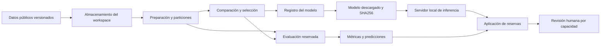

# Arquitectura

| Componente | Responsabilidad | Motivo |
| --- | --- | --- |
| Workspace Azure ML | Organizar trabajos, modelos y entornos | Trazabilidad de ejecución |
| Blob Storage | Entradas y artefactos | Separar datos del cómputo |
| CPU, 0–1 nodos | Ejecutar preparación, entrenamiento y evaluación | Limitar capacidad ociosa y concurrencia |
| Preparación | Contrato, deduplicación, fechas y particiones | Reducir contaminación temporal |
| Entrenamiento | Ajustar transformaciones y candidatos | Comparación controlada |
| Evaluación | Prueba reservada y errores | Medir generalización retrospectiva |
| Registro y descarga | Versión y huella del modelo | Vincular la aplicación con un trabajo |
| Servidor e interfaz local | Inferencia, lote, prioridad y exportación | Demostrar el uso sin endpoint permanente |

La imagen de ejecución y las dependencias deben conservarse con la evidencia del trabajo. Los datos originales y artefactos se identifican por huella. La aplicación no está configurada como servicio público de producción; requiere controles adicionales de identidad, TLS, almacenamiento, auditoría y capacidad para ese uso.
