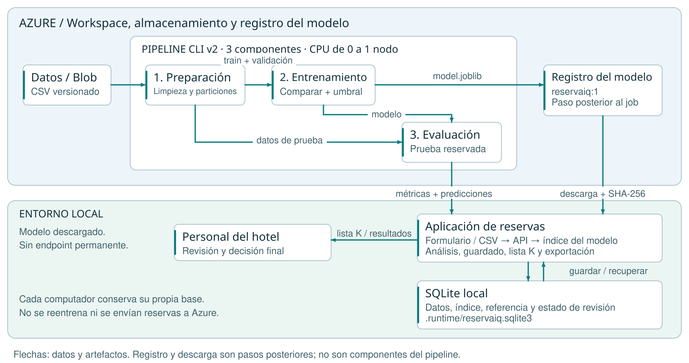
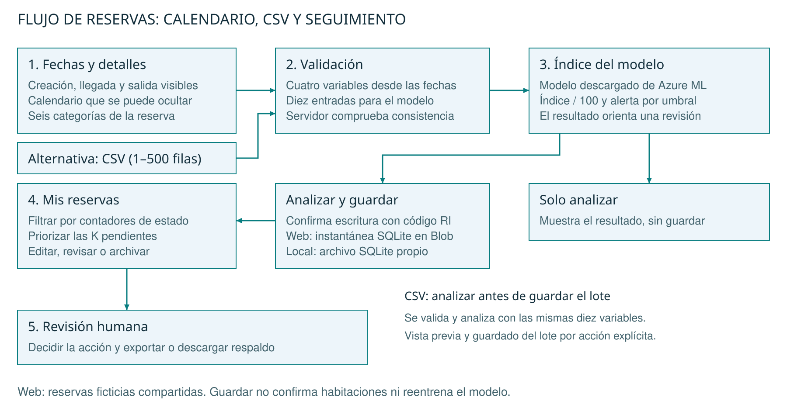

# Arquitectura y flujo de ReservaIQ



El diagrama representa **transferencias de datos y artefactos**. Las flechas no indican que todo se ejecute automáticamente ni constituyen un orden cronológico completo. El pipeline contiene exactamente tres componentes: preparación, entrenamiento y evaluación. El registro y la descarga se realizaron después de comprobar el trabajo terminado.

## Entrenamiento y evaluación en Azure

| Origen → destino | Qué se transfiere | Relación con la implementación |
| --- | --- | --- |
| CSV / Blob → preparación | Archivo original `hotels.csv` | Entrada `raw` de `azure/pipeline.yml` |
| Preparación → entrenamiento | Entrenamiento y validación | El componente recibe la carpeta `splits`; `train()` lee `train.csv` y `validation.csv` |
| Preparación → evaluación | Prueba reservada | El componente recibe `splits`; `evaluate()` lee `test.csv` para las métricas finales |
| Entrenamiento → evaluación | Modelo y selección fijada | Entrada `trained`: `model.joblib` y `selection.json` |
| Entrenamiento → registro | Artefacto `model.joblib` | Se registra como `reservaiq:1` desde la salida `trained` del trabajo completado |
| Evaluación → aplicación local | Métricas, ejemplos y predicciones descargadas | Salida `report`; `summary.json` alimenta las vistas de evidencia y la cohorte ilustrativa |
| Registro → aplicación local | Copia verificada del modelo | Descarga, SHA-256 y `artifacts/runtime.json` vinculan el modelo con su procedencia |
| Aplicación ↔ SQLite local | Copia de la reserva, resultado, referencia, estado y revisión | `storage.py` conserva los registros en `.runtime/reservaiq.sqlite3`; no modifica los artefactos históricos |
| Aplicación → personal del hotel | Índice, lista de tamaño K y exportaciones | La decisión sobre cualquier intervención sigue siendo humana |

El diagrama destaca el uso de la prueba en evaluación. La carpeta `splits` también contiene validación y el manifiesto: evaluación lee validación para la importancia por permutación, sin reajustar el modelo ni el umbral. Las salidas se conservan en Blob; las flechas entre etapas resumen esos archivos almacenados y no son conexiones de red directas entre servicios.

## Componentes y responsabilidades

| Componente | Responsabilidad | Por qué se utiliza |
| --- | --- | --- |
| Workspace Azure ML | Organizar trabajos, entornos y versiones registradas del modelo | Trazabilidad |
| Blob Storage asociado | Conservar las entradas y salidas de las etapas | Separar archivos del cómputo |
| Clúster CPU, 0–1 nodos | Ejecutar los tres componentes | Limitar capacidad ociosa y concurrencia |
| Preparación | Contrato de datos, deduplicación, fechas y particiones | Reducir contaminación temporal |
| Entrenamiento | Ajustar transformaciones, comparar candidatos y fijar el umbral con validación | Selección controlada, sin utilizar la prueba |
| Evaluación | Aplicar el modelo fijo a la prueba y producir métricas y predicciones | Medir generalización retrospectiva |
| Registro en Azure ML | Identificar el modelo como `reservaiq:1` | Conservar la procedencia y la versión |
| Descarga y verificación local | Comprobar archivo, huella y resultados | Vincular la demo con la ejecución documentada |
| Servidor e interfaz local | Validar entradas, inferir, analizar lotes, mostrar prioridad y exportar | Demostrar el uso sin endpoint permanente |
| SQLite local | Persistir copias, edición y estados de revisión mediante transacciones | Recuperar registros después de reiniciar, sin un servicio de nube adicional |
| Personal del hotel | Interpretar resultados y decidir las acciones | Mantener supervisión humana |

## Secuencia de ejecución y operación

1. Subir la entrada y ejecutar el pipeline definido en [`azure/pipeline.yml`](../azure/pipeline.yml).
2. Esperar las tres etapas completadas y revisar las salidas. **Evaluación no crea ni reentrena el modelo.**
3. Registrar el archivo de la salida de entrenamiento; descargar modelo y resultados. Estos pasos están documentados por separado en [`azure/README.md`](../azure/README.md).
4. Verificar SHA-256, procedencia y coincidencia de las 7.990 predicciones antes de utilizar el modelo en la aplicación.
5. Iniciar la aplicación local: una reserva o CSV pasa por validación de entradas y por el modelo para obtener índices. Inicio conserva una cohorte histórica ilustrativa de 150 reservas ya puntuadas. Mis reservas ordena las copias locales y marca las K pendientes de mayor índice; no es un sistema hotelero de producción.
6. Conservar las evidencias y cerrar los recursos temporales de Azure después de verificar las descargas. La demo continúa con sus archivos locales.

La ejecución y el registro en Azure son históricos: el grupo temporal fue eliminado tras conservar los resultados. No se necesita recrearlo para evaluar la demo. La aplicación no está publicada como servicio de producción.

## Fuente y reproducción del diagrama

El informe y las figuras del repositorio utilizan la misma definición vectorial en `scripts/diagrama_arquitectura.py`. La variante oscura mantiene la misma topología para reutilizarla en diapositivas. El flujo operativo amplía el detalle de la aplicación local y conserva los tres componentes del pipeline. Para regenerar las figuras y el informe:

```bash
python -m pip install -r requirements-docs.txt
python scripts/diagrama_arquitectura.py
python scripts/generar_informe.py
```

El diagrama muestra los componentes pertinentes a los criterios del microproyecto; los recursos auxiliares y supuestos de consumo están descritos en [Costos](COSTOS.md). La imagen de ejecución, las dependencias, los datos y los artefactos se identifican en las [evidencias](EVIDENCIAS.md).

## Guardado local y consistencia

El servidor valida las diez variables y calcula el resultado antes de escribir. SQLite conserva entradas y resultado juntos, con identificador, fecha, huella del modelo y número de revisión. Cada solicitud nueva lleva una clave de reintento: repetirla devuelve el mismo registro. Un lote se confirma completo o se revierte completo.

Editar exige la revisión que vio el usuario: si otra ventana cambió el registro, se devuelve un conflicto en lugar de sobrescribirlo. Archivar y restaurar son cambios reversibles de estado. La base no contiene etiquetas reales nuevas de cancelación y no alimenta el pipeline.

El almacenamiento vive en el computador que ejecuta el servidor; no hay sincronización entre integrantes ni nueva ejecución de Azure. La biblioteca [sqlite3 de Python](https://docs.python.org/3.12/library/sqlite3.html) permite gestionar archivos SQLite sin un servidor de base de datos separado. Se utilizan parámetros SQL y transacciones para las escrituras.


### Fechas dentro de la aplicación local

El calendario recibe creación, llegada y salida; calcula anticipación, mes de llegada y noches entre semana/de fin de semana. El servidor repite la validación antes de inferir o guardar. Son las mismas diez variables del modelo: las fechas completas se conservan como metadatos opcionales en SQLite, sin añadirse al entrenamiento. El día de salida se excluye de las noches. La migración al esquema 2 conserva las reservas previas con fechas desconocidas (`stay: null`). El flujo Azure y las métricas históricas permanecen iguales.



Las tres fechas permanecen visibles y se pueden elegir con el mismo calendario. Ocultarlo conserva la selección. **Solo analizar** devuelve el índice sin escribir una reserva. **Analizar y guardar** valida, calcula y conserva entradas y resultado, y confirma con un código RI. **Mis reservas** recupera los registros y permite consultar las categorías desde sus contadores, editar, revisar, archivar y restaurar.

La vía CSV utiliza el mismo contrato de diez variables. Después del análisis muestra una vista previa y requiere una acción explícita para guardar el lote. Los CSV y registros históricos sin fechas completas mantienen sus variables originales, sin inventar fechas de creación o estancia.

| Cambio de experiencia de usuario | Consecuencia en el diseño |
| --- | --- |
| Tres fechas visibles y calendario plegable | Captura y cálculo de variables en la interfaz, comprobados de nuevo por el servidor |
| Guardado, edición y recuperación | Base SQLite local con transacciones y control de revisiones |
| Contadores pulsables | Filtros de consulta sobre los registros locales |
| Lista de pendientes por capacidad K | Priorización operativa de las copias locales |
| Nuevas reservas y estados | No alteran el modelo, las particiones ni las métricas históricas |
