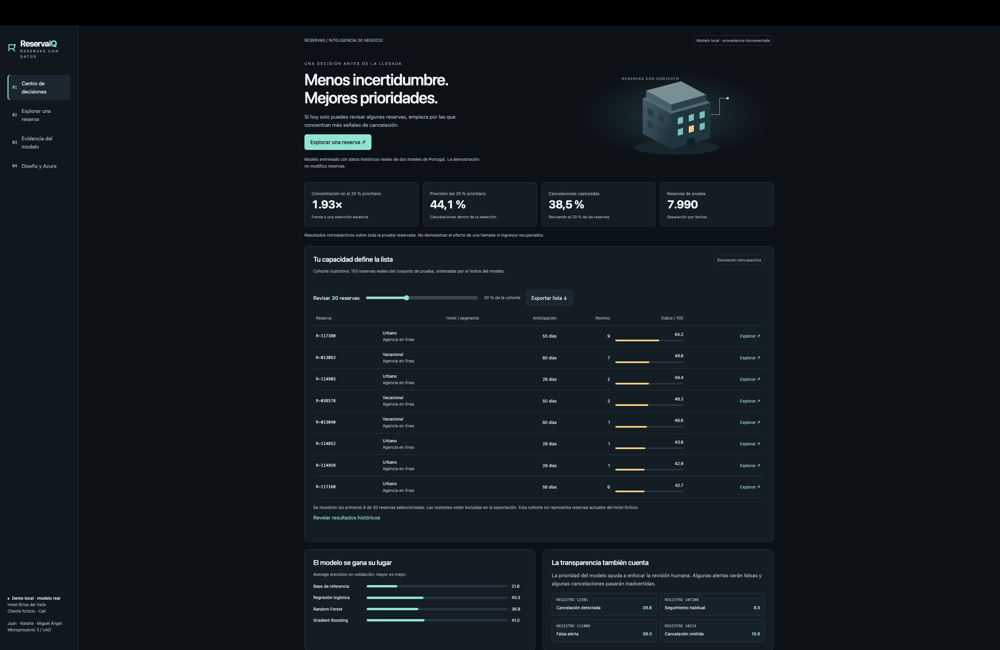
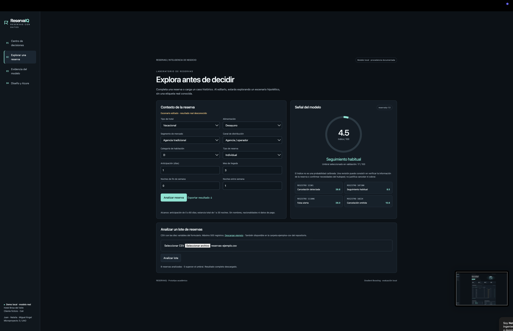
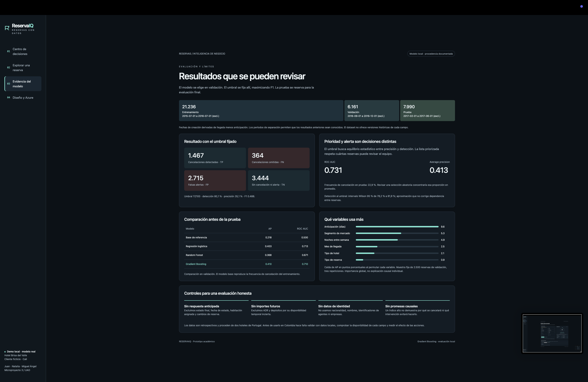
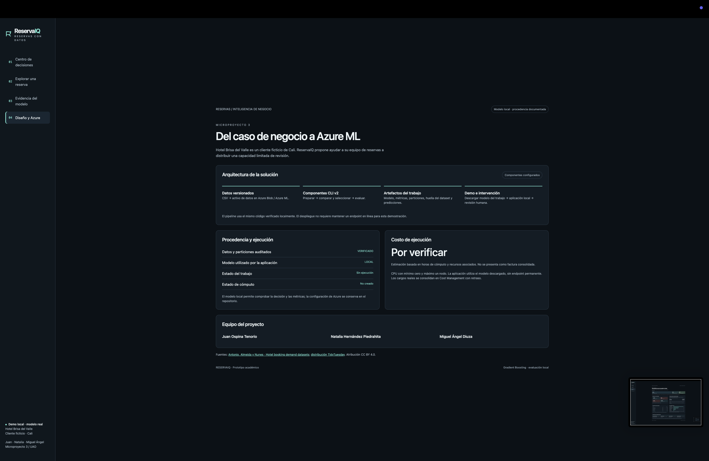

# Capturas comentadas de ReservaIQ

Las cuatro imágenes fueron aportadas por el equipo. Se conservan completas, con su resolución original y sin modificar los estados mostrados. La fecha y hora proceden del nombre de cada archivo; las huellas SHA256 y dimensiones se registran en [el manifiesto](capturas/manifest.json).

**Alcance de esta evidencia:** las capturas muestran una sesión identificada como modelo local. La cuarta vista indica “Sin ejecución” y “Por verificar”. Esos estados no acreditan la ejecución de Azure. El pipeline completado, el modelo descargado y el cierre de recursos están documentados en [Evidencias](EVIDENCIAS.md#evidencia-de-azure). No se ha determinado la causa de la diferencia entre la sesión capturada y los registros.

Las imágenes permiten revisar la apariencia y los resultados visibles. No sustituyen las pruebas del servidor ni certifican por sí solas las interacciones, descargas o la versión del modelo cargado. Haz clic en cada imagen para ampliarla.

## 1. Centro de decisiones

Fecha del nombre original: **2026-09-24 21:09:25**. Resolución: 2940 × 1912 píxeles.

**Qué se observa.** El tablero muestra 1,93 veces de concentración, 44,1 % de precisión y 38,5 % de cancelaciones capturadas al revisar el 20 % prioritario. El control de capacidad selecciona 30 reservas de una cohorte ilustrativa de 150; se muestran las primeras ocho filas.

**Por qué importa.** La decisión de negocio consiste en asignar una capacidad limitada de revisión. Las métricas superiores corresponden a las 7.990 reservas de prueba; la tabla utiliza una cohorte ilustrativa y no representa reservas actuales del hotel ficticio.

**Qué verifica y qué limita.** Se ven la lista ordenada, el selector de capacidad y los controles de exportación y consulta de resultados. Una imagen estática no verifica su interacción ni el archivo exportado.

## 2. Reserva individual y análisis por lote

Fecha del nombre original: **2026-09-24 21:09:30**. Resolución: 2940 × 1902 píxeles.

**Qué se observa.** El formulario contiene diez variables y muestra un escenario editado con índice 4,5 sobre 100: seguimiento habitual frente al umbral de 17. En el lote aparece reservas-ejemplo.csv y el mensaje de ocho reservas analizadas, ninguna sobre el umbral y resultado descargado.

**Por qué importa.** La inferencia individual y por lote usa el mismo contrato de entrada. Editar una reserva genera un escenario sin desenlace conocido. El índice no es una probabilidad calibrada y no justifica cancelar o cobrar una reserva.

**Qué verifica y qué limita.** La captura acredita el resultado visible de la sesión, no el contenido del archivo descargado. El CSV listo para cargar de esta entrega se llama reservas-listas.csv y se encuentra en ejemplos-csv/.

## 3. Evaluación y evidencia del modelo

Fecha del nombre original: **2026-09-24 21:09:35**. Resolución: 2940 × 1912 píxeles.

**Qué se observa.** Se muestran 21.236 registros de entrenamiento, 6.161 de validación y 7.990 de prueba. La matriz contiene 1.467 aciertos de cancelación, 364 cancelaciones omitidas, 2.715 falsas alertas y 3.444 reservas sin cancelación ni alerta. ROC AUC: 0,731; average precision: 0,413.

**Por qué importa.** La comparación de candidatos se realiza en validación y la prueba se reserva para evaluar el modelo elegido. La pantalla permite distinguir la alerta por umbral de la lista por capacidad y expone los errores que acompañan al resultado.

**Qué verifica y qué limita.** Los valores principales concuerdan con los artefactos entregados. La importancia por permutación es global, no una explicación causal individual. La etiqueta visible identifica la sesión como local.

## 4. Arquitectura, equipo y estado mostrado

Fecha del nombre original: **2026-09-24 21:09:41**. Resolución: 2940 × 1912 píxeles.

**Qué se observa.** La vista presenta datos versionados, componentes CLI v2, artefactos del trabajo y aplicación con revisión humana. Muestra a Juan Ospina Tenorio, Natalia Hernández Piedrahita y Miguel Ángel Diuza como equipo. En esta sesión aparecen modelo LOCAL, trabajo Sin ejecución, cómputo No creado y costo Por verificar.

**Por qué importa.** El diseño conecta preparación, comparación y evaluación con la descarga del modelo y la aplicación local. Los estados de esta captura no acreditan la ejecución en Azure ni corresponden al estado documentado en los registros de la entrega.

**Qué verifica y qué limita.** La ejecución Completed, el registro reservaiq:1 y el cierre de recursos se acreditan por separado en azure/evidence/. El escenario de costo es US$1 estimado; la factura no estaba consolidada en la consulta guardada. No se ha determinado la causa de la diferencia con la pantalla.
