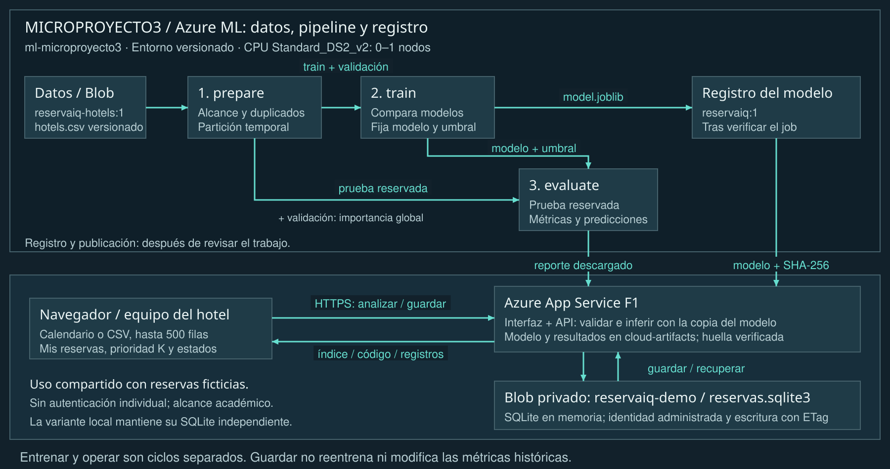
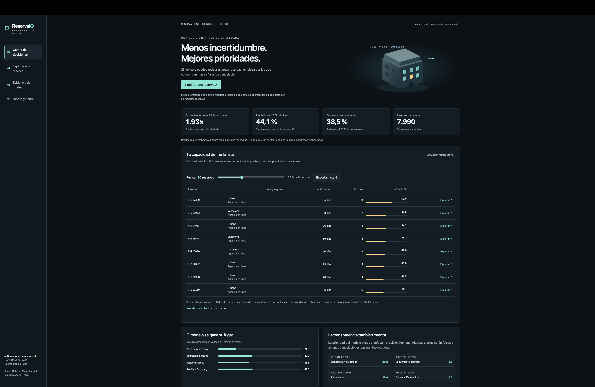
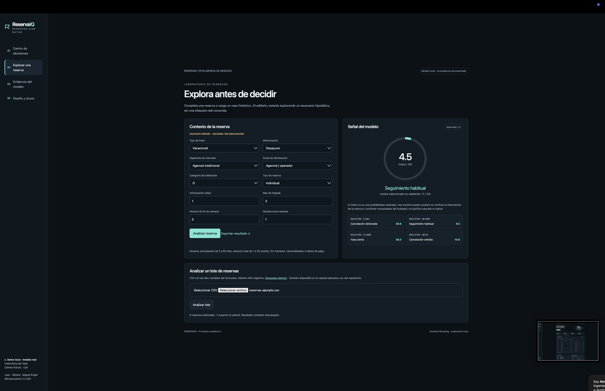
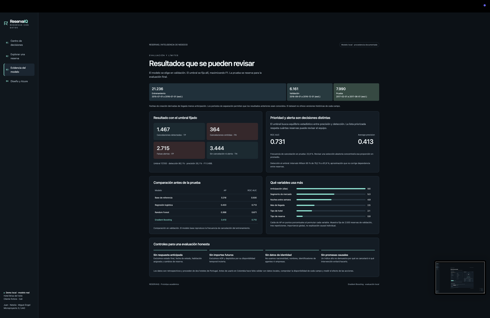
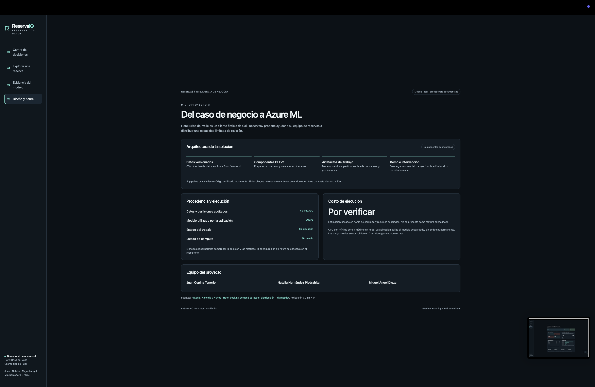
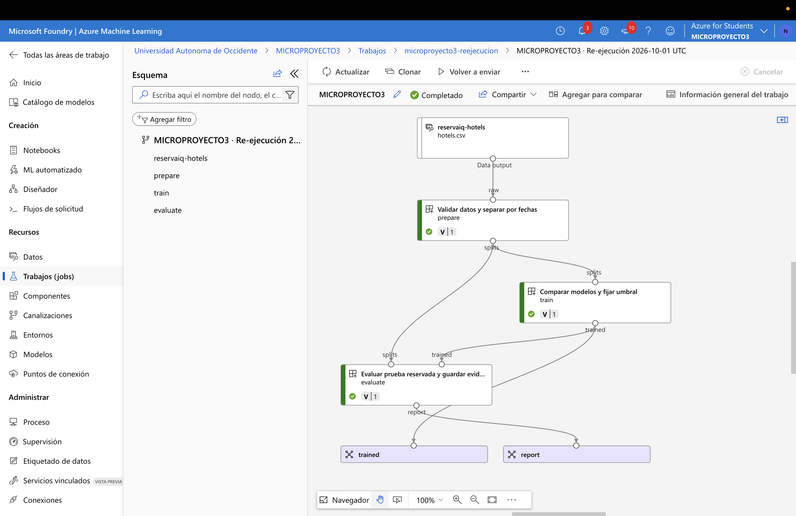

# ReservaIQ

Priorización de reservas hoteleras con aprendizaje automático

Microproyecto 3 · Computación en la Nube · UAO
Prof. Oscar Mondragón

## Equipo

Juan Ospina Tenorio
Natalia Hernández Piedrahita
Miguel Ángel Diuza

## Problema de negocio

Hotel Brisa del Valle es un cliente ficticio de Cali. Su equipo de reservas dispone de tiempo limitado para revisar confirmaciones. ReservaIQ ordena las reservas según un índice asociado a cancelación y selecciona una lista de tamaño K, ajustada a esa capacidad. El personal decide qué acciones realizar.

| Resultado retrospectivo | Valor |
| --- | --- |
| Reservas de prueba | 7.990 |
| Precisión del 20 % prioritario | 44,1 % |
| Cancelaciones capturadas en ese 20 % | 38,5 % |
| Concentración frente a selección aleatoria esperada | 1.93 veces |

Los datos son reales e históricos, de dos hoteles de Portugal. No pertenecen al cliente ficticio. Estas métricas no prueban ahorros, cancelaciones evitadas ni generalización a Colombia.

## Estado de la evidencia

Nueva ejecución MICROPROYECTO3 del 1 de octubre de 2026 UTC: tres etapas Completed, modelo reservaiq:1 y aplicación publicada en Azure App Service. Se verificaron 67 pruebas en Windows y Ubuntu, 31 comprobaciones HTTPS y nueve registros persistentes tras reiniciar App Service. El modelo y las 7.990 predicciones coinciden con los artefactos originales conservados. Las evidencias distinguen la ejecución original del 25 de septiembre de la nueva ejecución.

[Abrir la demo web en Azure](https://reservaiq-microproyecto3-20261001.azurewebsites.net/). Disponible hasta el 5 de octubre inclusive, hora de Colombia. La variante local se conserva en el repositorio. Solo se utilizan reservas ficticias.


---

# 1. Requerimientos y alternativas

La necesidad se traduce en una decisión verificable: qué reservas revisar primero cuando existe una capacidad K. El calendario permite elegir creación, llegada y salida. El guardado web conserva registros compartidos en un contenedor privado y los contadores permiten consultar su estado. La alerta por umbral complementa esa revisión.

| ID | Requerimiento | Criterio de aceptación |
| --- | --- | --- |
| R1 | Analizar una reserva | Validar diez variables y devolver índice, decisión y versión. |
| R2 | Priorizar revisión | Seleccionar exactamente K registros y exportar la lista. |
| R3 | Analizar un lote | CSV con 1-500 filas, máximo 150 KB y el mismo contrato. |
| R4 | Evaluar sin usar el futuro | Particiones temporales disjuntas y madurez de etiquetas. |
| R5 | Comparar y explicar | Candidatos, métricas, matriz y ejemplos de aciertos y errores. |
| R6 | Ejecutar en Azure ML | Tres componentes, trabajo Completed y artefactos verificables. |
| R7 | Limitar consumo | CPU, mínimo cero, máximo un nodo y límites de duración. |
| R8 | Conservar reservas ficticias | Guardar, recuperar y editar después de reiniciar; archivo reversible. |

## Alternativas consideradas

| Alternativa | Ventaja | Limitación |
| --- | --- | --- |
| Reglas manuales | Simplicidad y explicación | Umbrales rígidos y mantenimiento manual. |
| Clasificador y lista | Comparación y prioridad medible | Necesita datos y seguimiento de errores. |
| AutoML | Exploración automatizada | Más ensayos y consumo variable. |

Se elige clasificación supervisada con revisión humana. No hay integración con un sistema hotelero productivo, envío de mensajes, modificación de reservas ni cobros automáticos.


---

# 2. Datos, alcance y variables

Antonio, Almeida y Nunes publicaron 119.390 reservas de dos hoteles portugueses con llegadas en 2015-2017. Se conserva la distribución de TidyTuesday y su huella SHA256. Licencia de los datos originales: CC BY 4.0. [1, 2]

| Tratamiento | Registros |
| --- | --- |
| Archivo original | 119.390 |
| Alcance antes de deduplicar | 55.053 |
| Duplicados exactos retirados | 7.603 |
| Después de deduplicar | 47.450 |
| Incluidos en las tres particiones | 35.387 |
| Fuera de períodos o madurez | 12.063 |

## Contrato de diez variables

**Numéricas:** lead_time, arrival_month, stays_in_weekend_nights y stays_in_week_nights.
**Categóricas:** hotel, meal, market_segment, distribution_channel, reserved_room_type y customer_type.

Se admiten reservas con 0-60 días de anticipación, 1-30 noches totales, mes 1-12 y categorías conocidas. El diccionario completo está en ejemplos-csv/LEEME.md. No se usan identificadores de huéspedes ni contactos.

## Exclusiones para reducir fuga de información

Estado final, fecha de estado, habitación asignada y cambios pueden reflejar hechos posteriores. ADR y depósitos no garantizan disponibilidad al crear la reserva. Se excluyen también país e identificadores de agencia o empresa.

## Limitaciones del origen

La fecha de creación se deriva de llegada menos anticipación. No hay versiones históricas de los campos. La deduplicación puede eliminar reservas legítimas indistinguibles y no se puede excluir toda dependencia entre huéspedes recurrentes o grupos. El alcance no representa todos los hoteles ni todos los horizontes de reserva.


---

# 3. Método y selección

| Partición | Creación de reserva | Resultado antes de | n / cancelaciones |
| --- | --- | --- | --- |
| Entrenamiento | Jul 2015-jun 2016 | 01/09/2016 | 21.236 / 3.933 |
| Validación | Sep-nov 2016 | 01/02/2017 | 6.161 / 1.346 |
| Prueba | Feb-may 2017 | 01/09/2017 | 7.990 / 1.831 |

Los espacios entre períodos permiten que los desenlaces anteriores sean conocidos antes de la evaluación siguiente. Las particiones no se mezclan aleatoriamente. El manifiesto conserva los límites exactos y la prueba comprueba que no se comparten registros.

## Protocolo reproducible

1. Fijar alcance, fechas y semilla 42.
2. Ajustar escalado, codificación y modelos solo en entrenamiento.
3. Elegir el mayor average precision en validación.
4. Fijar umbral por máximo F1 en una cuadrícula de 0,05 a 0,95.
5. Evaluar la prueba reservada y conservar todas las predicciones.

| Modelo | AP validación | ROC AUC validación |
| --- | --- | --- |
| Base de referencia | 0.2185 | 0.5000 |
| Regresión logística | 0.4028 | 0.7134 |
| Random Forest | 0.3677 | 0.6714 |
| Gradient Boosting | 0.4103 | 0.7105 |

## Modelo elegido

Gradient Boosting, con umbral 0.17. La diferencia frente a regresión logística es modesta; no se afirma superioridad universal. Las configuraciones se limitan a una comparación manejable y no se ajustan usando la prueba.

Se fijan versiones de Python y librerías. selection.json documenta candidatos, barrido de umbral, duración de entrenamiento y entorno. model.joblib conserva transformaciones y clasificador juntos para evitar diferencias entre preparación e inferencia.


---

# 4. Arquitectura y flujo




---

# 4.1. Componentes y relaciones

| Componente | Responsabilidad |
| --- | --- |
| Workspace y Blob | Organizar trabajos, conservar entradas y artefactos. |
| Clúster CPU DS2 v2 | Ejecutar con mínimo 0, máximo 1 nodo e inactividad de 120 s. |
| Preparación | Aplicar alcance, deduplicación, fechas y particiones. |
| Entrenamiento | Comparar candidatos y fijar modelo y umbral. |
| Evaluación | Calcular métricas sobre prueba y exportar evidencia. |
| Registro y descarga | Versionar el modelo y comprobar su huella. |
| App Service y Blob privado | Interfaz HTTPS, inferencia, lotes y guardado compartido en instantáneas SQLite. |

Preparación entrega entrenamiento y validación al componente de entrenamiento, y prueba al de evaluación. Entrenamiento produce el modelo; evaluación recibe ese modelo y produce métricas y predicciones. Las flechas representan datos y artefactos. [3]

Registro y descarga son pasos posteriores al trabajo Completed, no componentes adicionales del pipeline. El registro pertenece a Azure. App Service carga una copia descargada y verificada del modelo. La variante local utiliza sus propios archivos.

La web aplica transacciones SQLite en memoria y conserva la instantánea en un Blob privado. Un ETag detecta escrituras concurrentes y la identidad administrada limita el acceso al contenedor. Los usuarios comparten registros ficticios. Guardar no cambia el entrenamiento ni las métricas históricas.

App Service sirve el modelo descargado sin mantener un endpoint de inferencia de Azure ML. artifacts/runtime.json vincula la aplicación con trabajo, estado Completed, versión y SHA256. La etiqueta de origen Azure exige coincidencia con el archivo cargado. El estado histórico del trabajo y el cierre de recursos se documentan por separado.


---

# 5. Resultados y decisión

| Métrica de prueba | Resultado |
| --- | --- |
| Average precision | 0.4134 |
| ROC AUC | 0.7307 |
| Detección al umbral 0.17 | 80,1 % |
| Precisión al umbral 0.17 | 35,1 % |
| F1 | 0.4879 |
| Brier del índice sin calibrar | 0.1560 |

| Desenlace real | Con alerta | Sin alerta |
| --- | --- | --- |
| Canceló | 1.467 | 364 |
| No canceló | 2.715 | 3.444 |

El umbral captura muchas cancelaciones y genera 2.715 falsas alertas. El hotel no tiene que revisar automáticamente todas las alertas: puede definir K según su capacidad.

## Revisar el 20 % prioritario

Se seleccionan 1.598 registros y 705 cancelaron. La precisión es 44,1 % y se captura 38,5 % de las cancelaciones. Frente a la frecuencia base de 22,9 %, la concentración es 1.93 veces la esperada con selección aleatoria. Es una comparación retrospectiva, no un experimento de intervención.

## Explicación y límites

La importancia por permutación utiliza 2.500 reservas de validación y tres repeticiones. Describe sensibilidad global, no causalidad individual. El intervalo Wilson de detección es aproximado y no corrige dependencia entre reservas. Los índices no son probabilidades calibradas.


---

# 6. Implementación y comprobación

App Service publica la interfaz y API por HTTPS y carga el modelo en memoria. La variante local escucha en 127.0.0.1. Las seis vistas son Inicio, Nueva reserva, Mis reservas, Cómo probarlo, Resultados del modelo y Diseño y Azure. El recorrido distingue analizar, guardar y revisar.

| Ruta | Comportamiento |
| --- | --- |
| GET /api/summary | Métricas, ejemplos y procedencia comprobada. |
| GET /api/health | Estado del servicio, modelo y huella. |
| GET /api/sample.csv | Ocho reservas listas para cargar. |
| POST /api/predict | Una reserva validada: inferencia sin guardar. |
| POST /api/batch | Entre 1 y 500 reservas: inferencia sin guardar. |
| GET /api/reservations | Consultar las reservas ficticias guardadas. |
| POST /api/reservations | Analizar y guardar una nueva reserva. |
| POST /api/reservations/batch | Guardar todo el lote o ninguna fila. |
| POST /api/reservations/update | Editar y recalcular con control de revisión. |
| POST /api/reservations/status | Revisar, archivar o restaurar. |

## Abrir la demo o iniciar la variante local

La demo se abre en https://reservaiq-microproyecto3-20261001.azurewebsites.net/ sin instalar Python. El nivel F1 puede dormirse y tardar en responder al inicio. Si se utiliza la alternativa local, ejecutar solo la línea del sistema correspondiente:

```bash
py -3.12 iniciar.py  # Windows
python3.12 iniciar.py  # macOS / Linux
```

Ejecutar únicamente la línea del sistema utilizado. El lanzador prepara el entorno y las dependencias. Abrir http://127.0.0.1:8765 y mantener la terminal abierta. En Nueva reserva, elegir llegada y salida en el calendario, completar Detalles y pasar a Revisar y guardar. Las noches y la anticipación se calculan automáticamente. Mis reservas permite recuperar el registro.

El CSV se selecciona en Nueva reserva, se analiza y muestra una vista previa. Guardar lote conserva todas las filas; Descargar resultados genera el JSON. La guía y las pruebas paso a paso están en docs/GUIA-DE-USO.md y docs/PRUEBAS-GUIADAS.md.


---

# 6.1. Calendario y guardado

## Tres pasos con resumen de estancia

Fechas, Detalles y Revisar y guardar separan las decisiones. El calendario calcula cuatro variables del modelo: anticipación, mes de llegada y noches entre semana/de fin de semana. La salida no cuenta como noche. El servidor valida la misma regla: 0 a 60 días de anticipación y 1 a 30 noches. Los ejemplos históricos sin fechas completas conservan sus variables originales.

## Qué se guarda y por qué

Cada reserva conserva referencia, diez variables, resultado, huella del modelo, fechas de creación/llegada/salida y estado de revisión. En Azure, Blob privado guarda la instantánea SQLite y un ETag controla concurrencia. En la variante local, .runtime/reservaiq.sqlite3 conserva una base independiente que no se publica en GitHub.

Solo analizar no modifica la base. Guardar cambios mantiene el identificador y exige la revisión vigente para evitar sobrescrituras entre ventanas. Los reintentos de una misma creación devuelven el mismo registro. Un fallo en un lote revierte todas sus escrituras. Archivar es reversible.

## Comprobar el recorrido

Con creación 01/10/2026, llegada 02/10 y salida 05/10 se obtienen 3 noches: 1 entre semana y 2 de fin de semana; anticipación de 1 día. Analizar y guardar conserva el registro con código RI-. Mis reservas permite recuperarlo, editarlo y organizarlo. Sus tarjetas Guardadas, Pendientes, Revisadas y Archivadas filtran los registros al pulsarlas. La guía incluye además el caso histórico 12301, el CSV y errores esperados.

## Comprobaciones automáticas y límites

Las pruebas Python cubren integridad del dataset y modelo, separación temporal, métricas, las 7.990 predicciones, UTF-8 en Windows, API y persistencia real. Incluyen reiniciar el servidor, reintentos concurrentes sin duplicación, conflictos de edición y transacciones de lote. También se prueban fechas, cambio de año, año bisiesto y migración de la base. JavaScript verifica calendario, tarjetas de estado y recorrido guiado con una API simulada.

```bash
python -m unittest discover -s tests -v
npm ci
npm test
```

GitHub Actions verificó 41 pruebas Python y 26 JavaScript en Windows y Ubuntu. Además se realizaron 31 comprobaciones HTTPS y nueve registros conservaron sus datos después de reiniciar App Service. La evidencia fechada registra el resultado de cada suite. Las capturas del anexo documentan la interfaz anterior de cuatro vistas: no acreditan visualmente el guardado nuevo. La navegación de la nueva versión en un navegador real queda pendiente de comprobación cuando el control de acceso permita abrirlo.

Las reservas nuevas no tienen una etiqueta real de cancelación conocida. No alimentan el entrenamiento ni alteran las métricas. Todos los usuarios de la web comparten registros ficticios. En modo local cada computador conserva una base independiente; para trasladarla se cierra la aplicación y se copia .runtime. La exportación JSON permite consultar los datos, pero esta versión no incluye importación de esas copias.


---

# 7. Costos, evidencia y conclusiones

| Alcance | Evidencia al 01/10/2026 03:20 UTC | USD |
| --- | --- | --- |
| Original rg-reservaiq | Consumo registrado antes de impuestos | 0,0620879781 |
| Nueva MICROPROYECTO3 | Sin filas de costo todavía | Por verificar |
| Conservación hasta 5 de octubre | Estimación, no factura | 2,0000 |
| Límite autorizado | No es un bloqueo automático | 3,0000 |

El consumo original incluye Virtual Machines 0,046234112; Storage 0,00857385; Virtual Network 0,0039041667; Container Registry 0,0032918494; Key Vault 0,000084 y Load Balancer 0 USD. No se atribuye ese total a la nueva ejecución. Cost Management puede ajustar cargos antes de la factura. El desglose y las consultas fechadas se conservan en docs/COSTOS.md.

La estimación de conservación supone hasta una hora CPU a US$0,146/h, seis días de Container Registry Basic a US$0,1666/día, App Service F1 gratuito y US$0,8544 reservados para almacenamiento, operaciones y margen. El escenario anterior de US$1 correspondía a una práctica breve con cierre inmediato. [4, 5]

## Controles y evidencia de aceptación

El clúster tiene mínimo cero y máximo un nodo, con inactividad de 120 segundos. Se verificó en cero después del trabajo. La nueva ejecución conserva datos, componentes, modelo y documentación en MICROPROYECTO3 hasta el 5 de octubre inclusive, hora de Colombia. Antes del cierre se deben respaldar y verificar las salidas y las reservas. Cero nodos no elimina todos los cargos.

La ejecución original terminó con la eliminación de rg-reservaiq el 25 de septiembre. La nueva ejecución es independiente y no sobrescribe artifacts/. El modelo descargado, sus huellas y las pruebas del despliegue permiten revisar la cadena desde Azure ML hasta la demo web.

## Conclusión

El experimento demuestra una priorización histórica con capacidad limitada y expone sus errores. Para utilizarlo en el hotel se requieren datos locales, auditoría de disponibilidad temporal de las variables y un experimento que mida el efecto de las acciones. La evidencia disponible no demuestra beneficios financieros.

## Fuentes

[1. Antonio, Almeida y Nunes: datos hoteleros](https://doi.org/10.1016/j.dib.2018.11.126)

[2. TidyTuesday: CSV y diccionario](https://github.com/rfordatascience/tidytuesday/tree/main/data/2020/2020-02-11)

[3. Microsoft: componentes de Azure ML](https://learn.microsoft.com/en-us/azure/machine-learning/reference-yaml-component-command?view=azureml-api-2)

[4. Microsoft: API de precios](https://learn.microsoft.com/en-us/rest/api/cost-management/retail-prices/azure-retail-prices)

[5. Microsoft: control de costos](https://learn.microsoft.com/en-us/azure/machine-learning/how-to-manage-optimize-cost?view=azureml-api-2)


---

# A1. Centro de decisiones

Captura aportada por el equipo · 2026-09-24 21:09:25 (según el nombre del archivo).

Captura de la interfaz anterior de cuatro vistas, sin guardado local. La sesión capturada muestra un indicador de modelo local. La ejecución en Azure se acredita por separado en los registros de evidencia.



**Qué se observa.** El tablero muestra 1,93 veces de concentración, 44,1 % de precisión y 38,5 % de cancelaciones capturadas al revisar el 20 % prioritario. El control de capacidad selecciona 30 reservas de una cohorte ilustrativa de 150; se muestran las primeras ocho filas.

**Por qué importa.** La decisión de negocio consiste en asignar una capacidad limitada de revisión. Las métricas superiores corresponden a las 7.990 reservas de prueba; la tabla utiliza una cohorte ilustrativa y no representa reservas actuales del hotel ficticio.

**Alcance.** Se ven la lista ordenada, el selector de capacidad y los controles de exportación y consulta de resultados. Una imagen estática no verifica su interacción ni el archivo exportado.

[Abrir la captura original a resolución completa](https://github.com/nathernandez1189/reservaiq-azure-ml/blob/main/docs/capturas/01-centro-decisiones.png) · docs/CAPTURAS.md amplía la explicación.


---

# A2. Reserva individual y lote

Captura aportada por el equipo · 2026-09-24 21:09:30 (según el nombre del archivo).

Captura de la interfaz anterior de cuatro vistas, sin guardado local. La sesión capturada muestra un indicador de modelo local. La ejecución en Azure se acredita por separado en los registros de evidencia.



**Qué se observa.** El formulario contiene diez variables y muestra un escenario editado con índice 4,5 sobre 100: seguimiento habitual frente al umbral de 17. En el lote aparece reservas-ejemplo.csv y el mensaje de ocho reservas analizadas, ninguna sobre el umbral y resultado descargado.

**Por qué importa.** La inferencia individual y por lote usa el mismo contrato de entrada. Editar una reserva genera un escenario sin desenlace conocido. El índice no es una probabilidad calibrada y no justifica cancelar o cobrar una reserva.

**Alcance.** La captura acredita el resultado visible de la sesión, no el contenido del archivo descargado. El CSV listo para cargar de esta entrega se llama reservas-listas.csv y se encuentra en ejemplos-csv/.

[Abrir la captura original a resolución completa](https://github.com/nathernandez1189/reservaiq-azure-ml/blob/main/docs/capturas/02-reserva-y-lote.png) · docs/CAPTURAS.md amplía la explicación.


---

# A3. Evidencia del modelo

Captura aportada por el equipo · 2026-09-24 21:09:35 (según el nombre del archivo).

Captura de la interfaz anterior de cuatro vistas, sin guardado local. La sesión capturada muestra un indicador de modelo local. La ejecución en Azure se acredita por separado en los registros de evidencia.



**Qué se observa.** Se muestran 21.236 registros de entrenamiento, 6.161 de validación y 7.990 de prueba. La matriz contiene 1.467 aciertos de cancelación, 364 cancelaciones omitidas, 2.715 falsas alertas y 3.444 reservas sin cancelación ni alerta. ROC AUC: 0,731; average precision: 0,413.

**Por qué importa.** La comparación de candidatos se realiza en validación y la prueba se reserva para evaluar el modelo elegido. La pantalla permite distinguir la alerta por umbral de la lista por capacidad y expone los errores que acompañan al resultado.

**Alcance.** Los valores principales concuerdan con los artefactos entregados. La importancia por permutación es global, no una explicación causal individual. La etiqueta visible identifica la sesión como local.

[Abrir la captura original a resolución completa](https://github.com/nathernandez1189/reservaiq-azure-ml/blob/main/docs/capturas/03-evidencia-modelo.png) · docs/CAPTURAS.md amplía la explicación.


---

# A4. Diseño y ejecución

Captura aportada por el equipo · 2026-09-24 21:09:41 (según el nombre del archivo).

Captura de la interfaz anterior de cuatro vistas, sin guardado local. La sesión capturada muestra un indicador de modelo local. La ejecución en Azure se acredita por separado en los registros de evidencia.



**Qué se observa.** La vista presenta datos versionados, componentes CLI v2, artefactos del trabajo y aplicación con revisión humana. Muestra a Juan Ospina Tenorio, Natalia Hernández Piedrahita y Miguel Ángel Diuza como equipo. En esta sesión aparecen modelo LOCAL, trabajo Sin ejecución, cómputo No creado y costo Por verificar.

**Por qué importa.** El diseño conecta preparación, comparación y evaluación con la descarga del modelo y la aplicación local. Los estados de esta captura no acreditan la ejecución en Azure ni corresponden al estado documentado en los registros de la entrega.

**Alcance.** La ejecución Completed, el registro reservaiq:1 y el cierre de recursos se acreditan por separado en azure/evidence/. El escenario de costo es US$1 estimado; la factura no estaba consolidada en la consulta guardada. No se ha determinado la causa de la diferencia con la pantalla.

[Abrir la captura original a resolución completa](https://github.com/nathernandez1189/reservaiq-azure-ml/blob/main/docs/capturas/04-diseno-azure.png) · docs/CAPTURAS.md amplía la explicación.


---

# Evidencia visual de Azure ML

Captura aportada por el equipo: 30 de septiembre de 2026, 21:50 en Colombia, equivalente al 1 de octubre UTC. Corresponde a la nueva ejecución MICROPROYECTO3, no al trabajo original del 25 de septiembre.



La pantalla muestra el dataset, las etapas prepare, train y evaluate en verde, y las salidas trained y report. El flujo entrega particiones y modelo al evaluador. Las comprobaciones independientes de API y los registros del trabajo complementan esta evidencia visual.

La imagen se conserva completa y sin alterar. No acredita el costo facturado, la conservación tras reiniciar ni la identidad de quien ejecutó cada paso. Esas afirmaciones requieren sus registros específicos.
